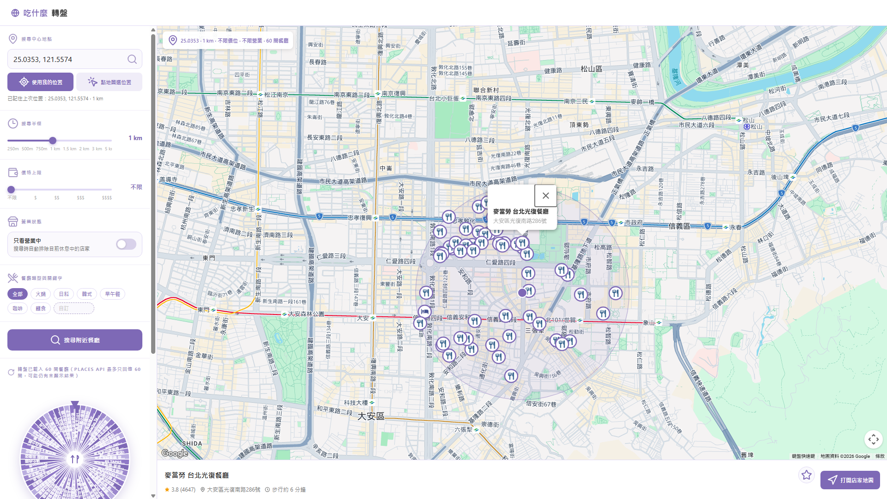
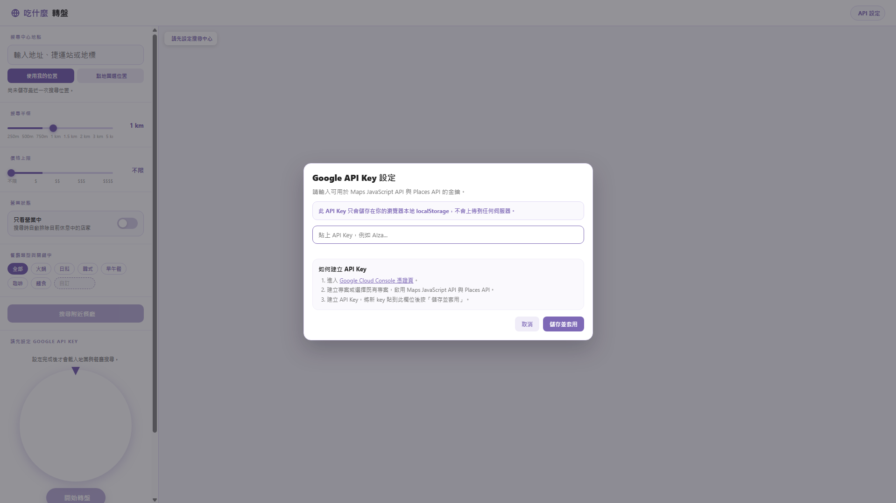

# 吃什麼轉盤（Google Maps Food Roulette）

一個純前端單頁工具：設定搜尋中心、半徑與篩選條件後，從附近餐廳中用轉盤隨機抽店家，並在地圖上顯示位置。

## 主要功能

- Google Maps + Places Nearby Search
- 搜尋中心設定（輸入地址 / 我的定位 / 點地圖）
- 半徑、價格、營業中、關鍵字篩選
- 搜尋結果逐步載入（有資料先顯示）
- 地圖標點（圓點樣式，支援店家 icon）
- 轉盤抽籤 + 結果卡片
- 收藏與歷史紀錄（localStorage）
- API Key 設定彈窗（僅儲存本地）

## 專案結構

- `index.html`：單一檔案，含 HTML / CSS / JavaScript

## Showcase

## 本機使用

1. 直接用瀏覽器開 `index.html`，或用 VS Code Live Server 啟動。
2. 右上角點「API 設定」，貼上可用的 Google API Key。
3. 開始設定搜尋條件並搜尋。

## 需要啟用的 Google API

請在 Google Cloud Console 啟用：

- Maps JavaScript API
- Places API

## API Key 儲存方式

- API Key 只會存在你的瀏覽器 `localStorage`
- Key 不會上傳到本專案的伺服器（此專案為純前端）

## GitHub Pages 部署

可以部署到 GitHub Pages。

基本流程：

1. 將專案推到 GitHub repository。
2. 到 repository 的 Settings -> Pages。
3. Source 選擇 `Deploy from a branch`，branch 選 `main`（或你的部署分支）與根目錄。
4. 等待部署完成，打開 `https://<your-account>.github.io/<repo>/`。

> 補充：若你在不同網域部署，請確認你建立的 API Key 在該網域可正常使用。

## 已知限制

- Places Nearby Search 並非完整資料庫全量回傳，單次可拿到的店家數有限。
- 即使使用逐步載入，也可能仍有部分店家不在回傳結果中。

## 授權

目前未指定授權條款，如要開源建議補上 `LICENSE`。
